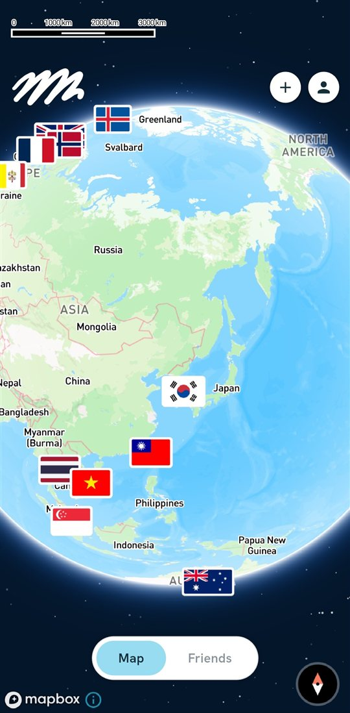
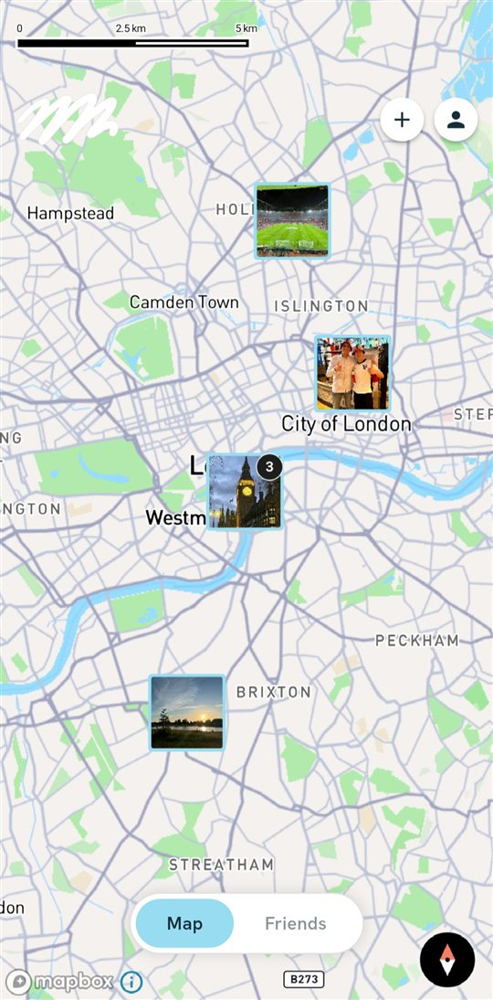
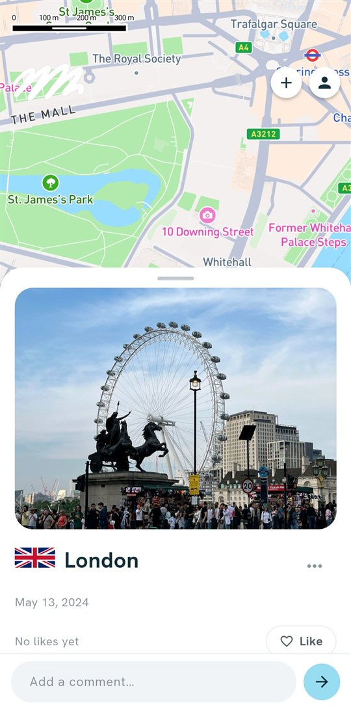
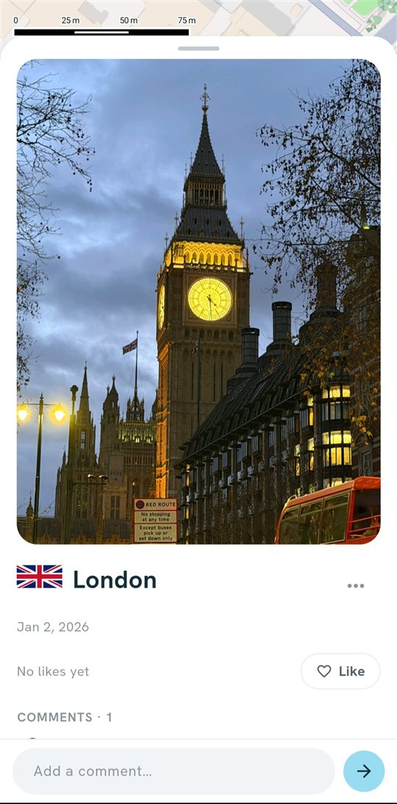
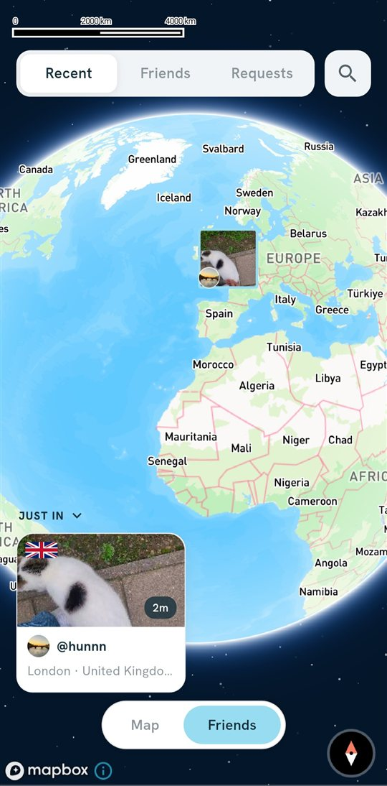
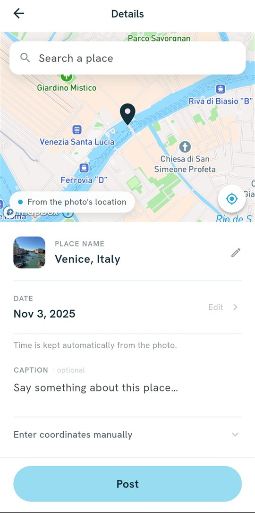
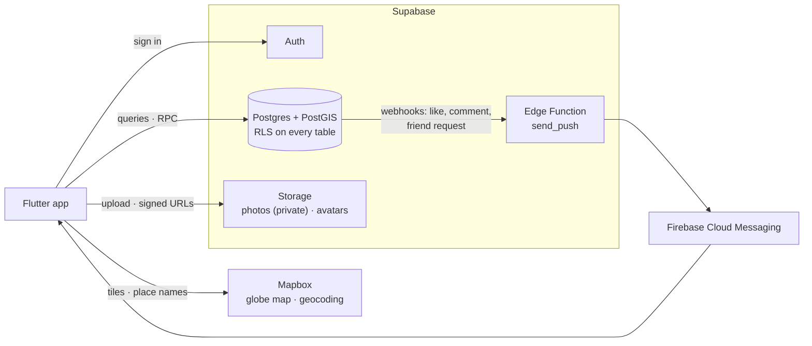
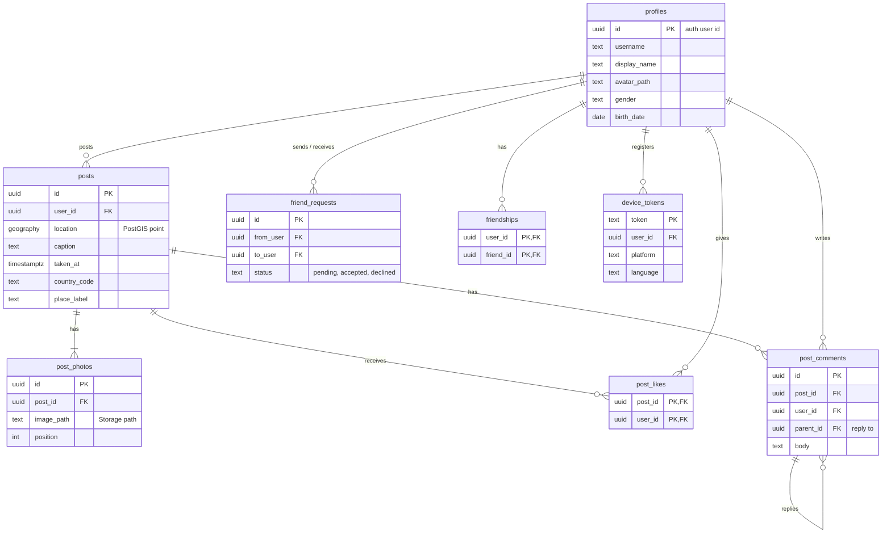

<div align="center">
  

  <h1>waylo</h1>
  <p><strong>Enjoy Your Trip And Write It Down</strong></p>

  <p>
    
    
    
    
    
    
  </p>
</div>

---

## About

waylo is a minimal, map-based photo-sharing app. Pin your photos to the places
they were taken on your own map, add friends, and open a friend's map to see
theirs. A "Recent" map shows what your friends posted in the last 24 hours.
Nothing is public: a photo is visible only to its owner and their accepted
friends.

---

## Features

### My map
<div align="center">
  
  
</div>

- Zoomed out, a globe with a flag for every country you've posted in; tap a flag
  to fly to those photos
- Zoomed in, photos pinned where they were taken; nearby photos group into one
  pin with a count
- Every user has their own map; friends can open yours, strangers see nothing

<br/>

### Photos
<div align="center">
  
  
</div>

- Tap a pin to open the photo sheet: place, date, caption
- Likes and guestbook-style comments with replies
- Edit (location, date, place name, caption) or delete your own posts

<br/>

### Friends & Recent
<div align="center">
  
</div>

- **Recent:** every friend's last-24-hour posts on one globe, plus a "Just in"
  card strip
- Friends list with a "passport strip" of the countries each friend has posted
  in; tap to open their map
- Search people by username, send and accept friend requests
- Push notifications (Android) for friend requests, accepts, likes and comments

<br/>

### Posting
<div align="center">
  
</div>

- Pick from your library or take a photo, then crop (preset or free ratio)
- Location and date are read from the photo; fine-tune by dragging the map,
  searching a place, or typing coordinates
- The place name is filled in automatically and can be edited

<br/>

### Everywhere
- Five languages (English, 한국어, 日本語, 中文, Español), including place names
  and push notifications
- Light and dark themes

---

## How It Works

There is no custom server. The app talks to Supabase directly, and every access
rule lives in the database.



- **Access control is Row Level Security, not app code.** Whether you can see a
  photo (owner or accepted friend) is decided by Postgres policies, and the
  actor always comes from `auth.uid()`, never from the request.
- **Multi-row writes are single Postgres functions** (create a post, accept a
  friend request, delete an account), so they can't half-fail.
- **Map queries use PostGIS:** each user's map asks for their posts inside the
  visible bounding box, plus per-country aggregates for the flag view.
- **Fast markers:** a small thumbnail is uploaded next to every photo, markers
  are clustered on screen and cached on disk, so the map fills in quickly even
  though the photo bucket is private.

---

## Database ERD



---

## Tech Stack

| | Technology |
|---|---|
| **App** | Flutter (Dart) · Android first, iOS pending |
| **Map** | Mapbox Maps SDK (globe projection) · Mapbox Geocoding |
| **Backend** | Supabase: Postgres + PostGIS, Auth, Storage |
| **Access control** | Row Level Security + Postgres functions (RPC) |
| **Push** | Supabase Edge Function (TypeScript) → Firebase Cloud Messaging |
| **i18n** | Flutter gen-l10n, 5 languages |

---

## Getting Started

Keys are not in the repo. You need:

- the Flutter SDK;
- a Mapbox **secret download token** (`sk...`, scope `DOWNLOADS:READ`) in
  `~/.gradle/gradle.properties`: `MAPBOX_DOWNLOADS_TOKEN=sk...`;
- `app/lib/config/app_keys.dart`, copied from `app_keys.example.dart` and
  filled in (Supabase publishable key, Mapbox public `pk.` token);
- `app/android/app/google-services.json` from the Firebase console.

Then, with an Android device attached:

```bash
cd app
flutter pub get
flutter run
```

Checks: `flutter analyze` and `flutter test` (from `app/`).

See `CLAUDE.md` → "Setting up on a new machine" for where each key comes from,
and "Applying schema changes" before adding a migration. Server-side secrets
(`service_role`, the FCM service account, the webhook secret) live only in the
Supabase dashboard.

### Repository

```
app/        Flutter app (lib/, android/, ios/, test/)
supabase/   migrations/ (schema, RLS, RPCs, storage) · functions/send_push/
docs/       ROADMAP.md (status + plan), DESIGN.md, POST.md, SETTINGS.md
CLAUDE.md   scope, architecture rules, code map, setup
```

---

## Developer

**Jihun Cho**
- GitHub: [@Jihun37](https://github.com/Jihun37)
